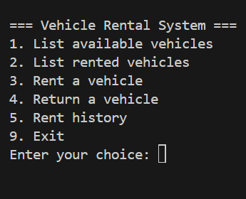
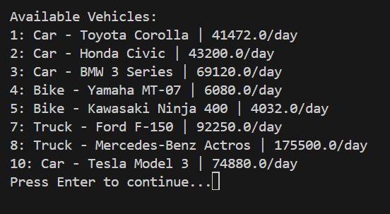
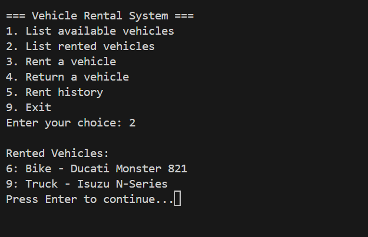
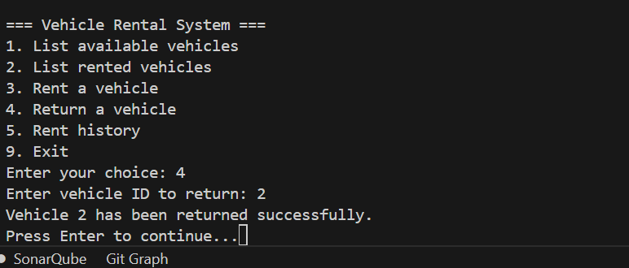
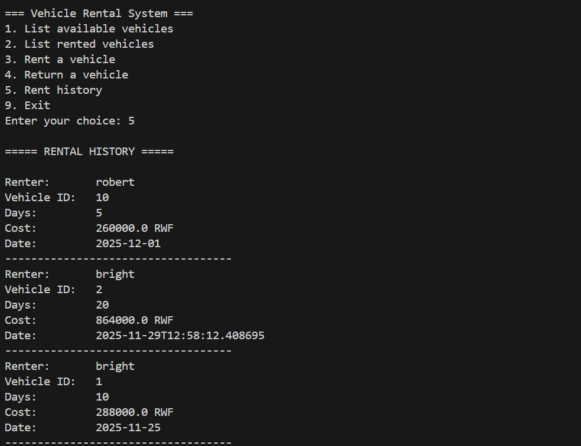

# Vehicle Rental System

A Python-based command-line vehicle rental management system that allows users to rent, return, and manage different types of vehicles (Cars, Bikes, and Trucks). The system uses object-oriented programming principles with inheritance and polymorphism to handle different vehicle types with varying pricing strategies.

## 📋 Table of Contents

- [Features](#features)
- [Project Structure](#project-structure)
- [Architecture](#architecture)
- [Installation](#installation)
- [Usage](#usage)
- [Vehicle Types & Pricing](#vehicle-types--pricing)
- [Data Storage](#data-storage)
- [Development](#development)
- [Contributing](#contributing)
- [License](#license)

## ✨ Features

- **Vehicle Management**: View available and rented vehicles
- **Filtering Options**: Filter vehicles by brand or type
- **Rental Operations**: Rent vehicles with automatic cost calculation
- **Return Operations**: Return rented vehicles and update availability
- **Rental History**: View complete rental transaction history
- **Dynamic Pricing**: Different pricing strategies for different vehicle types
- **Data Persistence**: All data is stored in JSON files for persistence

## 📁 Project Structure

```
vehicle_rental_system/
│
├── src/
│   └── vehicle_rental_system/
│       ├── models/
│       │   ├── vehicle.py      # Abstract base class for vehicles
│       │   ├── car.py          # Car implementation
│       │   ├── bike.py         # Bike implementation
│       │   └── truck.py        # Truck implementation
│       │
│       ├── services/
│       │   ├── vehicle_manager.py    # Manages vehicle data and queries
│       │   └── rental_service.py     # Handles rental/return operations
│       │
│       └── utils/
│           ├── file_handler.py       # JSON file I/O operations
│           └── helpers.py            # Utility functions
│
├── data/
│   ├── vehicles.json          # Vehicle inventory data
│   └── rentals.json          # Rental transaction history
│
├── tests/                     # Test directory (structure ready)
├── main.py                    # Application entry point
├── pyproject.toml            # Poetry configuration
├── poetry.lock               # Dependency lock file
└── README.md                 # This file
```

## 🏗️ Architecture

The system is built using object-oriented design principles:

### Models Layer

- **Vehicle (Abstract Base Class)**: Defines the common interface and properties for all vehicles
- **Car, Bike, Truck**: Specialized vehicle classes that inherit from Vehicle and implement different pricing strategies

### Services Layer

- **VehicleManager**: Handles vehicle data persistence, loading, and querying operations
- **RentalService**: Manages rental transactions, returns, and rental history

### Utilities Layer

- **FileHandler**: Abstraction for JSON file operations
- **Helpers**: Common utility functions for CLI interactions

### Key Design Patterns

- **Inheritance**: Vehicle subclasses inherit common behavior
- **Polymorphism**: Different vehicle types calculate prices differently
- **Separation of Concerns**: Clear separation between data models, business logic, and file I/O

## 🚀 Installation

### Prerequisites

- Python 3.13 or higher
- Poetry (recommended) or pip

### Setup with Poetry (Recommended)

1. Clone the repository:

```bash
git clone https://github.com/JoeBright1619/vehicle_rental_system.git
cd vehicle_rental_system
```

2. Install Poetry if you haven't already:

```bash
# Windows
(Invoke-WebRequest -Uri https://install.python-poetry.org -UseBasicParsing).Content | python -

# macOS/Linux
curl -sSL https://install.python-poetry.org | python3 -
```

3. Install dependencies:

```bash
poetry install
```

4. Activate the virtual environment:

```bash
activate
```

## 💻 Usage

### Starting the Application

Run the main script:

```bash
python main.py
```

### Main Menu

Upon starting, you'll see the main menu:



### Feature Guide

#### 1. List Available Vehicles

View all available vehicles or filter by:

- **All vehicles**: Shows complete list of available vehicles
- **By brand**: Filter vehicles by specific brand (e.g., "Toyota", "Honda")
- **By type**: Filter by vehicle type (Car, Bike, or Truck)

**Example Output:**



#### 2. List Rented Vehicles

View all currently rented vehicles with their details.



#### 3. Rent a Vehicle

Rent a vehicle by providing:

- Your name
- Vehicle ID
- Number of rental days

The system will:

- Check vehicle availability
- Calculate total cost based on vehicle type
- Update vehicle status
- Record the transaction in rental history

**Example:**


#### 4. Return a Vehicle

Return a rented vehicle by entering the vehicle ID. The system will:

- Verify the vehicle is currently rented
- Update availability status to available
- Persist the change to disk



#### 5. Rental History

View all rental transactions in reverse chronological order (most recent first). Each entry includes:

- Renter name
- Vehicle ID
- Number of days
- Total cost (in RWF)
- Rental date

**Example Output:**



## 💰 Vehicle Types & Pricing

The system implements different pricing strategies for each vehicle type using polymorphism:

### Car

- **Pricing**: Base price + 20% surcharge
- **Formula**: `price_per_day = base_price × 1.2`
- **Example**: Base price 34,560 RWF → Rental price 41,472 RWF/day

### Bike

- **Pricing**: Base price with 20% discount
- **Formula**: `price_per_day = base_price × 0.8`
- **Example**: Base price 7,600 RWF → Rental price 6,080 RWF/day

### Truck

- **Pricing**: Base price + 50% premium
- **Formula**: `price_per_day = base_price × 1.5`
- **Example**: Base price 61,500 RWF → Rental price 92,250 RWF/day

## 💾 Data Storage

The system uses JSON files for data persistence:

### `data/vehicles.json`

Stores vehicle inventory information:

- Vehicle ID
- Type (Car, Bike, Truck)
- Brand and Model
- Base price
- Availability status

### `data/rentals.json`

Stores rental transaction history:

- Renter name
- Vehicle ID
- Number of days
- Total cost
- Rental date (ISO format)

**Note**: The data files are automatically created if they don't exist. The `data/` directory is included in `.gitignore` by default to prevent committing sensitive data.

## 🔧 Development

### Running Tests

The project includes a comprehensive test suite using pytest. The tests cover models, services, and utilities with high coverage.

#### Installing Test Dependencies

First, install the required testing packages:

```bash
poetry add --dev pytest pytest-cov pytest-mock
```

#### Test Structure

The test suite is organized as follows:

```
tests/
├── __init__.py           # Package initialization
├── conftest.py           # Shared fixtures and pytest configuration
├── test_models.py        # Tests for vehicle model classes
├── test_services.py      # Tests for VehicleManager and RentalService
└── test_utils.py         # Tests for utility classes and functions
```

#### Running Tests

Run all tests:

```bash
pytest
```

Run tests with verbose output:

```bash
pytest -v
```

Run tests with coverage report:

```bash
pytest --cov=src/vehicle_rental_system --cov-report=html --cov-report=term
```

Run a specific test file:

```bash
pytest tests/test_models.py
```

Run a specific test:

```bash
pytest tests/test_models.py::TestCar::test_car_pricing_applies_20_percent_surcharge
```

#### Test Coverage

The test suite covers:

- **Models (`test_models.py`)**:
  - Vehicle abstract class behavior
  - Car, Bike, and Truck inheritance
  - Pricing calculations for each vehicle type
  - Polymorphic behavior
- **Services (`test_services.py`)**:
  - VehicleManager: Loading, saving, and querying vehicles
  - RentalService: Renting, returning, and rental history
  - Error handling for invalid operations
- **Utils (`test_utils.py`)**:
  - FileHandler: JSON file read/write operations
  - Helper functions

#### Writing New Tests

When adding new features, ensure you:

1. Add tests in the appropriate test file
2. Follow the existing test naming conventions (`test_*`)
3. Use descriptive test names that explain what is being tested
4. Add fixtures in `conftest.py` for reusable test data
5. Mock file I/O operations to keep tests isolated

Example test structure:

```python
def test_feature_does_something():
    """Test that feature performs expected behavior."""
    # Arrange
    # Act
    # Assert
    pass
```

### Adding New Vehicle Types

To add a new vehicle type:

1. Create a new class in `src/vehicle_rental_system/models/` that inherits from `Vehicle`
2. Implement the `vehicle_type()` method
3. Override `price_per_day` property if custom pricing is needed
4. Update `VehicleManager.load_vehicles()` to handle the new type
5. Add the new type to the menu options in `main.py`

### Code Style

The project follows Python PEP 8 style guidelines. Consider using:

- `black` for code formatting
- `flake8` or `pylint` for linting
- Type hints for better code documentation

## 🤝 Contributing

Contributions are welcome! Please follow these steps:

1. Fork the repository
2. Create a feature branch (`git checkout -b feature/amazing-feature`)
3. Commit your changes (`git commit -m 'Add some amazing feature'`)
4. Push to the branch (`git push origin feature/amazing-feature`)
5. Open a Pull Request

### Development Setup

1. Ensure you have Poetry installed
2. Install development dependencies:

```bash
poetry install --with dev
```

3. Make your changes
4. Run tests before submitting
5. Update documentation as needed

## 📝 License

This project is open source and available under the MIT License (or your preferred license).

## 👤 Author

**JoeBright1619**

- Email: brightcollin1619@gmail.com

## 🙏 Acknowledgments

- Built with Python 3.13+
- Managed with Poetry
- Uses JSON for simple, portable data storage

---

_For issues, questions, or suggestions, please open an issue on the repository._
